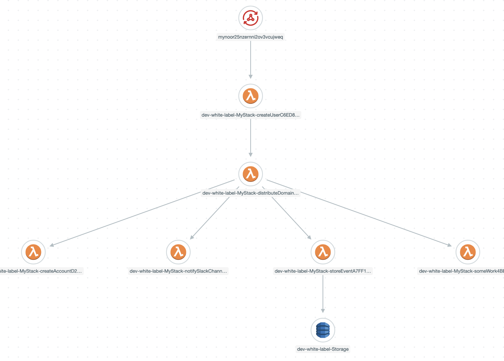
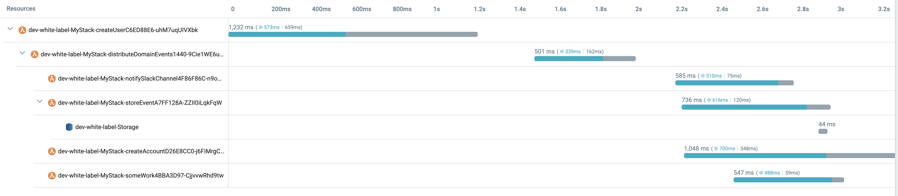
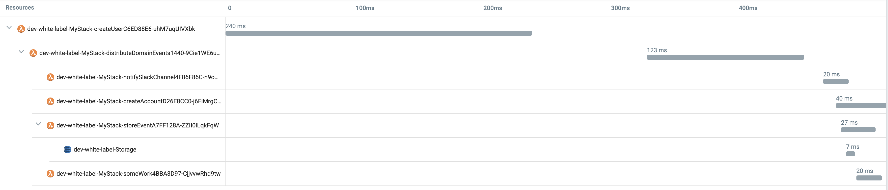
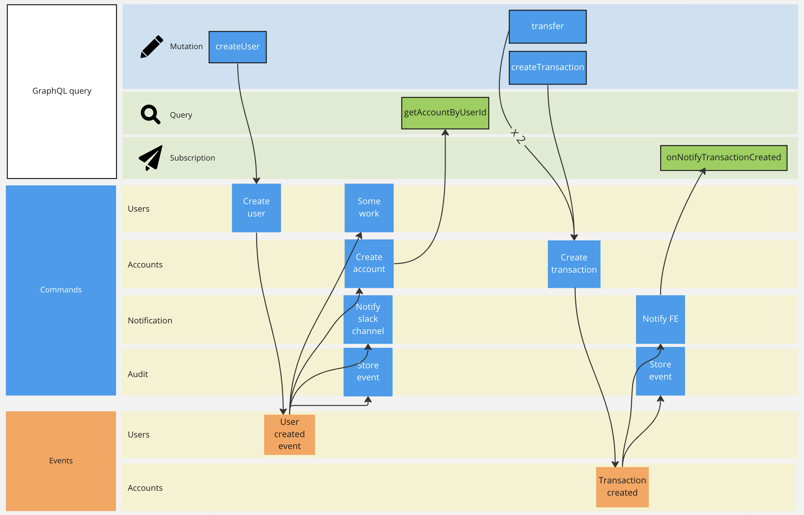

# Serverless Domain-Driven Design (DDD) вместе с Unit тестами

События предметной области являются фундаментальным строительным блоком в DDD. Если вы хотите указать событие, значимое для вашего приложения, поднимите это событие и позвольте другим модулям вашего приложения подписаться и отреагировать на него.
Этот проект иллюстрирует `CreateUser` вариант использования и то, как мы можем инициировать событие, сигнализируя о том, что у нас есть новый пользователь.

События предметной области (например , [UserCreatedEvent](src/modules/users/domain/events/UserCreatedEvent.ts)) отправляются после того, как изменения агрегатов ([User](src/modules/users/domain/User.ts)) сохраняются в базе данных. Мы можем подписаться на него из того же модуля ([SomeWork](src/modules/users/useCases/someWork/SomeWork.ts)) или из другого ([StoreEvent](src/modules/audit/useCases/storeEvent/StoreEvent.ts), [NotifySlackChannel](src/modules/notification/useCases/notifySlackChannel/NotifySlackChannel.ts), [CreateAccount](src/modules/accounts/useCases/createAccount/CreateAccount.ts)).

Связь в том же модуле приведена в качестве примера, но использование событий предметной области для связи внутри модуля/приложения внутри одной и той же модели предметной области может потребовать добавления косвенности, которая не добавляет ценности, а прямой/явный поток более удобен.

Точка входа лямбда для варианта `CreateUser` использования [src/modules/users/useCases/createUser/index.ts](src/modules/users/useCases/createUser/index.ts), там мы:
* Создать контроллер [CreateUser](src/modules/users/useCases/createUser/CreateUser.ts) controller
* Класс  `CreateUser.constructor` Создает `UserCreatedEvent` в промежуточной лямбде [DistributeDomainEvents](src/shared/infra/invocation/DistributeDomainEvents.ts) которая будет вызывать всех своих подписчиков (`StoreEvent`, `CreateAccount`, `NotifySlackChannel` и `SomeWork` лямбда-выражения).

Это отслеживание транзакции от [Lumigo](https://lumigo.io):

<br />
<p align="center">
    
</p>
<br />

## Хронология

Если с момента последнего запроса прошло какое-то время, мы получаем холодные запуски, и выполнение `createUser` занимает ~1,2 с, а все вызванные лямбда-выражения ( , , и `distributeDomainEvents`, `createAccount`, `notifySlackChannel`, `storeEvent` и `someWrok`) дополнительные ~2,1 с, поэтому вся распределенная транзакция занимает ~3 ,3с:

<br />
<p align="center">
    
</p>
<br />

Если мы повторим запрос в течение следующих 5 м, у нас не будет холодных запусков, createUserэто займет 240 мс, все вызванные лямбда-выражения будут дополнительно ~280 мс, поэтому вся распределенная транзакция займет ~520 мс:
<br />
<p align="center">
    
</p>
<br />

## Моделирование событий

<br />
<p align="center">
    
</p>
<br />

## Тесты

Модульные тесты (с поддельными репозиториями):

- Value Objects: 
    - Users: [UserName](src/modules/users/domain/UserEmail.unit.ts), [UserEmail](src/modules/users/domain/UserEmail.unit.ts), [UserPassword](src/modules/users/domain/UserPassword.unit.ts), [Alias](src/modules/users/domain/Alias.unit.ts)
    - Accounts: [Amount](src/modules/accounts/domain/Amount.unit.ts), [Description](src/modules/accounts/domain/Description.unit.ts)
- Aggregates:
    - Users: [User](src/modules/users/domain/User.unit.ts)
    - Accounts: [Account](src/modules/accounts/domain/Account.ts) (with internal entity [Transaction](src/modules/accounts/domain/Transaction.unit.ts))
- Services:
    - Accounts: [AccountService](src/modules/accounts/services/AccountService.unit.ts)
- Use cases/controllers: 
    - Users: [CreateUser](src/modules/users/useCases/createUser/CreateUser.unit.ts), [SomeWork](src/modules/users/useCases/someWork/SomeWork.unit.ts)
    - Notification: [NotifySlackChannel](src/modules/notification/useCases/notifySlackChannel/NotifySlackChannel.unit.ts), [NotifyFE](src/modules/notification/useCases/notifyFE/NotifyFE.unit.ts)
    - Accounts: [CreateTransaction](src/modules/accounts/useCases/createTransaction/CreateTransaction.unit.ts), [GetAccountByUserId](src/modules/accounts/useCases/getAccountByUserId/GetAccountByUserId.unit.ts), [Transfer](src/modules/accounts/useCases/transfer/Transfer.unit.ts)
    - Audit: [StoreEvent](src/modules/audit/useCases/storeEvent/StoreEvent.unit.ts)

Интеграционные тесты (реальные репозитории):

- Users:
  - [CreateUser](src/modules/users/useCases/createUser/CreateUser.int.ts), event registration and dispatching [CreateUserEvents](src/modules/users/useCases/createUser/CreateUserEvents.int.ts)
- Accounts:
  - [GetAccountByUserId](src/modules/accounts/useCases/getAccountByUserId/GetAccountByUserId.int.ts)
  - [CreateTransaction](src/modules/accounts/useCases/createTransaction/CreateTransaction.int.ts), event registration and dispatching [CreateTransactionEvents](src/modules/accounts/useCases/createTransaction/CreateTransactionEvents.int.ts)
  - [Transfer](src/modules/accounts/useCases/transfer/Transfer.int.ts), dispatching the creation of 2 transactions [TransferEvents](src/modules/accounts/useCases/transfer/TransferEvents.int.ts)

E2E-тесты:

- Users:
  - [CreateUser](src/modules/users/useCases/createUser/CreateUser.e2e.ts)
- Accounts:
  - [Transfer](src/modules/accounts/useCases/transfer/Transfer.e2e.ts)
  - [GetAccountByUserId](src/modules/accounts/useCases/getAccountByUserId/GetAccountByUserId.e2e.ts)
  - [CreateTransaction](src/modules/accounts/useCases/createTransaction/CreateTransaction.e2e.ts)
- Notifications:
  - [NotifyFE](src/modules/notification/useCases/notifyFE/NotifyFE.e2e.ts)

## Декораторы

Для сквозных задач используются следующие декораторы:

* [ReturnUnexpectedError](src/shared/decorators/ReturnUnexpectedError.ts): когда мы получаем запрос клиента FE, а сервер выдает непредвиденную ошибку, мы регистрируем ошибку, запрос и контекст; и вернуть корректно сформированный ответ об ошибке клиенту FE. Варианты использования: [CreateUser](src/modules/users/useCases/createUser/index.ts), [GetAccountByUserID](src/modules/accounts/useCases/getAccountByUserId/index.ts), [CreateTransaction](src/modules/accounts/useCases/createTransaction/index.ts) and [Transfer](src/modules/accounts/useCases/transfer/index.ts)
* [Transaction](src/shared/decorators/Transaction.ts): все варианты использования команд, использующие базу данных SQL, должны быть заключены в сериализуемую транзакцию (для случаев использования запросов этого не требуется). Варианты использования: [CreateUser](src/modules/users/useCases/createUser/index.ts), [CreateAccount](src/modules/accounts/useCases/createAccount/index.ts), [CreateTransaction](src/modules/accounts/useCases/createTransaction/index.ts) and [Transfer](src/modules/accounts/useCases/transfer/index.ts)
* [DBretry](src/shared/decorators/DBretry.ts): Обработка повторных попыток при сбоях подключения к базе данных/Sequelize. Варианты использования [CreateUser](src/modules/users/useCases/createUser/index.ts), [CreateAccount](src/modules/accounts/useCases/createAccount/index.ts), [GetAccountByUserID](src/modules/accounts/useCases/getAccountByUserId/index.ts), [CreateTransaction](src/modules/accounts/useCases/createTransaction/index.ts) and [Transfer](src/modules/accounts/useCases/transfer/index.ts)

## Технологии Стэк

* DBs: PostgreSQL [CockroachDB](https://www.cockroachlabs.com) Serverless and DynamoDB
* ORM: [Sequelize](https://sequelize.org)
* IaC: [SST Serverless Stack](https://sst.dev)
* AWS services: Lambda, AppSync, хранилище параметров диспетчера систем
* Testing: Jest

Я использовал SST Serverless Stack , так как он позволяет локально отлаживать лямбда-код при удаленном вызове ресурсов в AWS.

## Описание

Я начал этот проект с помощью модуля white-label Халила Штеммлера [white-label](https://github.com/stemmlerjs/white-label)

Я также добавил модули `accounts`, `audit`, `notifications`, декораторы для сквозных задач для поддержки транзакций SQL и повторных попыток БД, провел рефакторинг с REST на GraphQL API, превратил его в бессерверный и написал кучу тестов.

## Инструкции

```
npm ci
npm test
```
